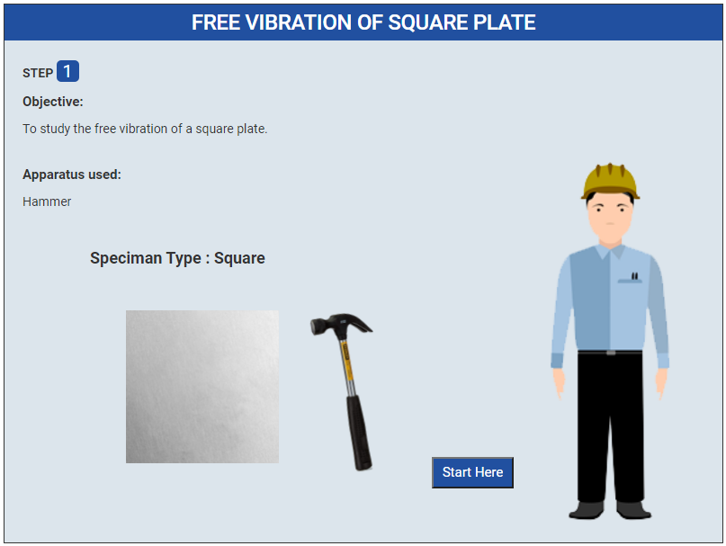
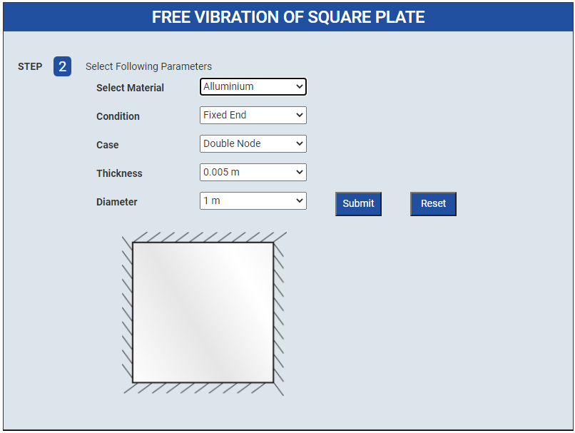
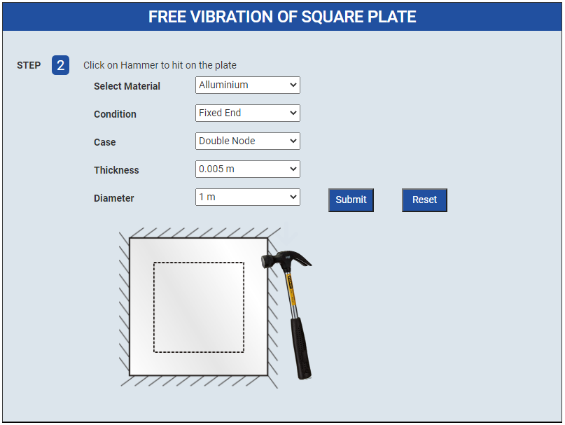
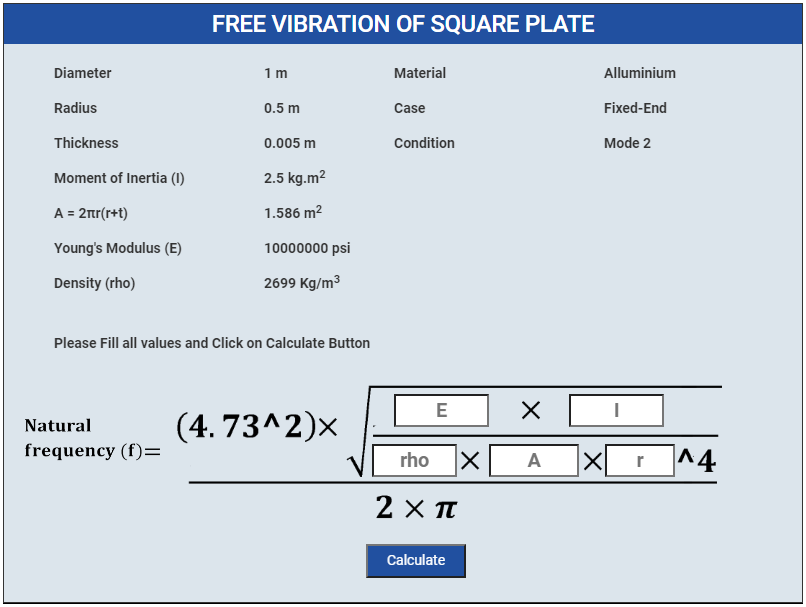
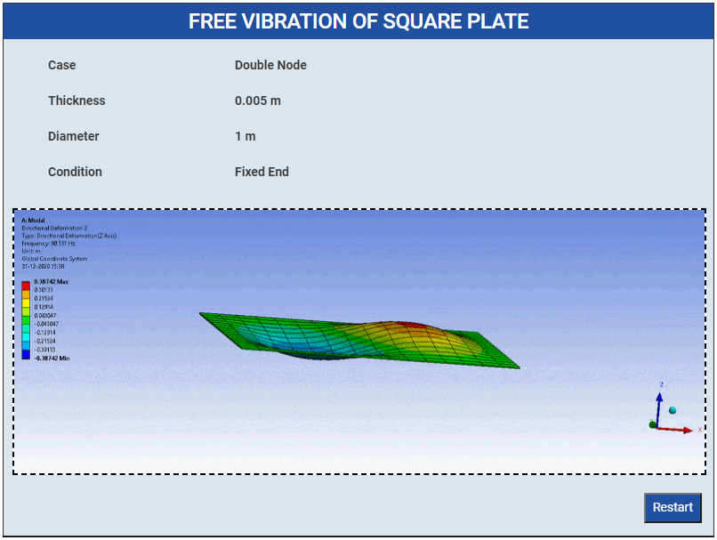

### Procedure

1. Click on Start Here button to start the experiment.
 

2. Select Following Parameters and Click Submit button
 

3. After Submit values Click on Hammer to hit on the plate
 

4. Please Fill all values these are given and Click on Calculate Button
 

5. Show the Graphs
 

