### EXPERIMENTAL METHODOLOGY

<strong>EQUATION OF MOTION: CLASSICAL PLATE THEORY

1.1 Equilibrium Approach

</strong>

The small deflection theory of thin plates, called classical plate theory or Kirchhoff theory, is based on assumptions similar to those used in thin beam or Euler-Bernoulli beam theory. The following assumptions are made in thin or classical plate theory:

1. The thickness of the plate (h) is small compared to its lateral dimensions.

2. The middle plane of the plate does not undergo in-plane deformation. Thus, the midplane
remains as the neutral plane after deformation or bending.

3. The displacement components of the midsurface of the plate are small compared to the thickness of the plate.

4. The influence of transverse shear deformation is neglected. This implies that plane sections normal to the midsurface before deformation remain normal to the midsurface even after deformation or bending. This assumption implies that the transverse shear strains, &#949;xy and &#949;yz, are negligible, where z denotes the thickness direction.

5. The transverse normal strain &#949;zz under transverse loading can be neglected. The transverse normal stress &#963;zz is small and hence can be neglected compared to the other components of stress.

Some of the important relations and equations are summarized below for a rectangular plate (see Fig. 1.1).

Moment resultant-transverse displacement relations:
 

 
where D, the flexural rigidity of the plate, is given by
 
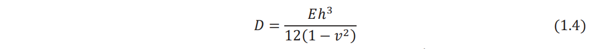
 

where h is the thickness, E is Young's modulus, and v is Poisson's ratio of the plate.

Shear force resultants: 
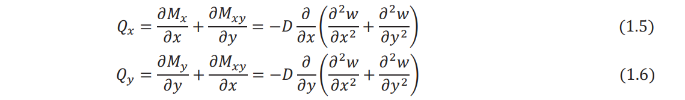  
Equation of motion (force equilibrium in the z direction): 
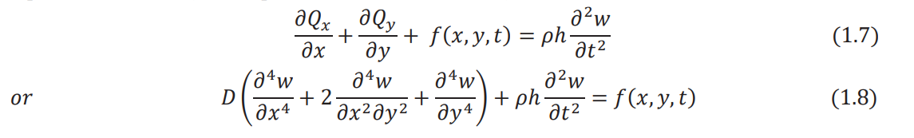  
where &#961; is the density of the plate and &#402; is the distributed transverse load acting on the plate per unit area.

<b>1.2 Variational Approach</b>

Because of assumptions 4 and 5 in Section 1.1, the state of stress in a thin plate can be assumed to be plane stress. Thus, the nonzero stresses induced in a thin plate are given by &#963;xx, &#963;yy, and &#963;xy. The strain energy density &#960;0 of the plate can be expressed as 
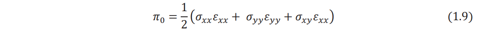  
The strain components can be expressed in terms of the transverse displacement of the middle surface of the plate, w(x, y), as follows: 
  
The stress–strain relations permit stresses to be expressed in terms of the transverse displacement,
w(x, y), a 
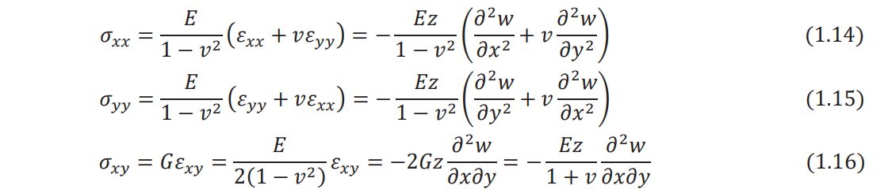  
By substituting Eqs. (1.10)-(1.12) and Eqs. (1.14)-(1.16) into Eq. (1.9), the strain energy density
can be written in terms of w as 
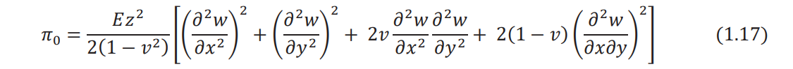  

Integrating Eq. (1.17) over the volume of the plate (V), the strain energy of bending can be obtained
as 
  

where dV = dAdz denotes the volume of an infinitesimal element of the plate. Noting that 
  

is the flexural rigidity of the plate (D), Eq. (1.18) can be rewritten as 
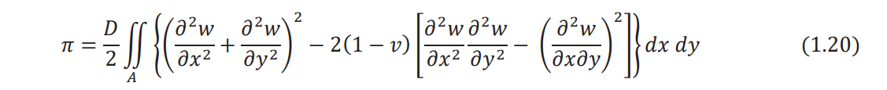  

Considering only the transverse motion and neglecting the effect of rotary inertia, the kinetic
energy of the plate (T) can be expressed as 
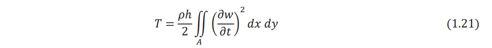  

If there is a distributed transverse load, &#402; (x, y,t), acting on the plate, the work done by the
external load (W) is given by 
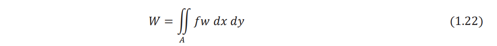  

The generalized Hamilton's principle can be used to derive the equations of motion: 
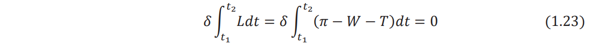  

Substituting Eqs. (1.20) - (1.22) into Eq. (1.23), Hamilton's principle can be written as 
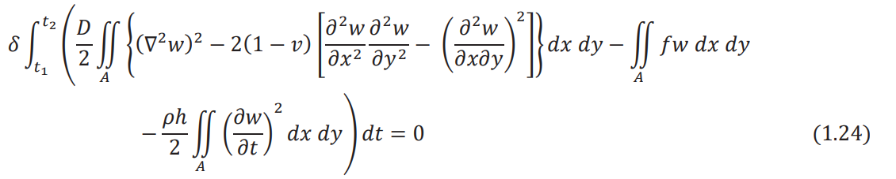  

where &#8711;2 denotes the harmonic operator with 
  

Performing the variation of the first integral term in Eq. (1.24), we have 
  

By using the two-dimensional Green's theorem, Eq. (1.26) can be written as 
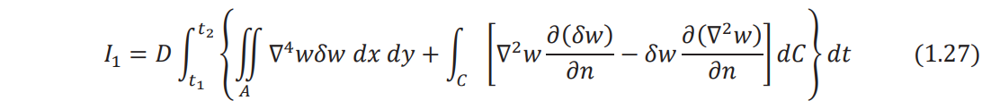  

where C denotes the boundary of the plate, n indicates the outward drawn normal to the boundary, and &#8711;4 represents the biharmonic operator, so that 
  

Note that the integration on the boundary &#8747;C
, extends all around the boundary of the plate.
Similarly, we can express the variation of the second integral term in Eq. (1.24) as 
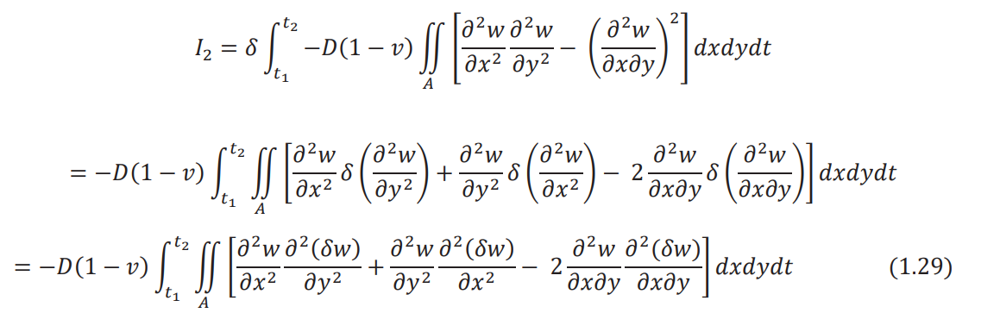  

Noting that the quantity under the sign of the area integral in Eq. (1.29) can be written as 
  

Equation (1.29) can be expressed as 
  

Using the relations 
  

Eq. (1.33) can be rewritten as
 
  
where &#952; is the angle between the outward drawn normal to the boundary (n) and the x axis as
shown in Fig. 1.1. The quantities &#8706;(&#948;w)/&#8706;x and &#8706;(&#948;w)/&#8706;y appearing in h1 and h1
[Eqs. (1.31) and (1.32)] can be transformed into the new coordinate system (n, s) as follows: 

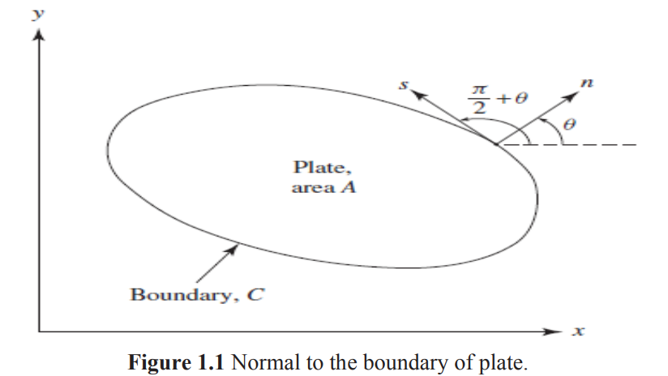  

  

where s is the tangential direction to the boundary. In view of Eqs. (1.37) and (1.38), Eqs. (1.31)
and (1.32) can be expressed as 
 
  

When Eqs. (1.39) and (1.40) are substituted, Eq. (1.36) becomes  
  
The second integral involving integration with respect to C can be integrated by parts using the
relation  
  
where in the present case, g(x, y) is given by  
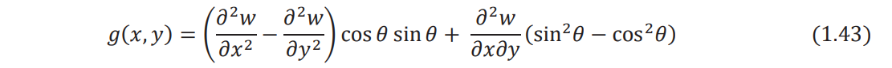  

Since the variation of displacement, &#948;w, on the boundary is zero, Eq. (1.42) reduces to  
  

Inserting Eq. (1.43) in (1.44) and the result in Eq. (1.41), we obtain  
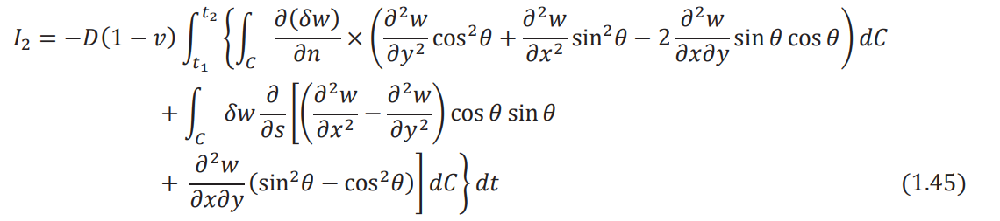  

The variation of the third integral term in Eq. (1.24) can be expressed as  
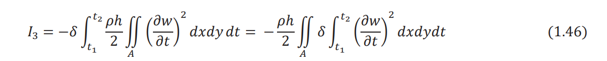  

By using integration by parts with respect to time, the integral I3 can be written as  
  

Since the variation of the displacement (&#8706;w) is zero at t1 𝑎nd t2
, Eq. (1.47) reduces to  
  

where w = &#8706; 2w /&#8706;t2 .The variation of the last integral term in Eq. (1.24) yields  
  

Using Eqs. (1.27), (1.45), (1.48), and (1.49), Hamilton's principle of Eq. (1.24) can be expressed
as  
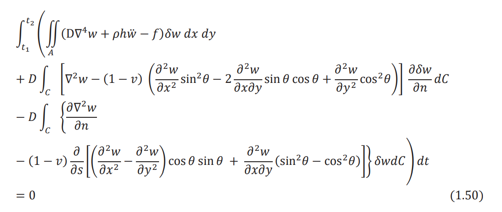  

To satisfy Eq. (1.50), each of the three terms within the outside parentheses must be zero.
Furthermore, since &#948;w is arbitrary, the expression inside the parentheses under the area integral
must be zero. This leads to the relations  
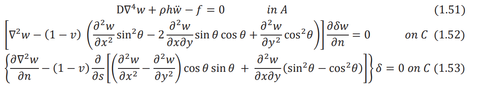  

It can be seen that Eq. (1.51) is the equation of motion for the transverse vibration of a plate and
Eqs. (1.52) and (1.53) are the boundary conditions. Note that for a clamped or fixed edge, the
deflection and the slope of deflection normal to the edge must be zero (Fig. 1.2):  
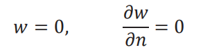  

Thus, &#948;w = 0, &#8706;&#948;w/&#8706;n = 0 in Eqs. (1.52) and (1.53). For a simply supported edge, the deflection
is zero and the slope of deflection normal to the edge is not zero (Fig. 1.2):  
  

Thus, &#948;w = 0 in Eq. (1.53) and &#8706;&#948;w/&#8706;n is arbitrary in Eq. (1.52). Hence, the expression in braces,
which will later be shown to be equal to the bending moment on the edge, must be zero. For a free
edge, there is no restriction on the values of w, and &#8706;w/&#8706;n and hence &#8706;w and &#8706;&#948;w/&#8706;n are
arbitrary. Hence, the expressions inside braces in Eqs. (1.53) and (1.52), which will later be shown
to be equal to the effective shear force and bending moment, respectively, on the edge, must be
zero.  
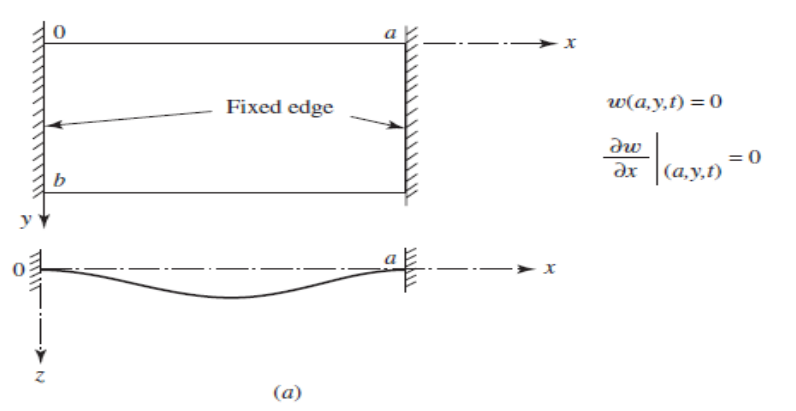 
 
